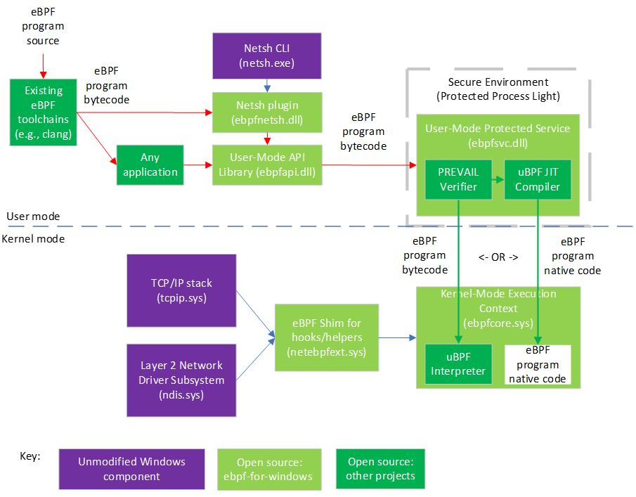

## 前言

[eBPF](https://ebpf.io/) 是一项众所周知的革命性技术--提供了可编程性、可扩展性和敏捷性。eBPF 已被应用于拒绝服务保护和可观察性等场景。随着时间的推移，围绕eBPF建立了重要的工具，产品和经验生态系统。尽管最初在 Linux 内核中实现了对 eBPF 的支持，但是人们越来越关注允许 eBPF在其他操作系统上使用，并且除了内核以外，还可以扩展用户模式服务和守护程序。

今天，我们很高兴地宣布一个新的微软开源项目，以使 eBPF 在 Windows 10 和 Windows Server 2016 及以后的版本上运行。[ebpf-for-windows 项目](https://aka.ms/ebpf-for-windows)旨在让开发者在现有版本的 Windows 之上使用熟悉的eBPF工具链和应用编程接口（API）。在其他项目的基础上，该项目采用了几个现有的 eBPF 开源项目，并添加了 "胶水"，以使其能在Windows 上运行。

我们宣布这个消息时，但该项目仍处于相对早期的开发阶段，因为我们的目标是与强大的 eBPF 社区合作，以确保 eBPF 在 Windows 和其他地方都可以正常工作。

## 架构概述 

下图说明了该项目的结构和相关的组成部分。

如图所示，现有的 eBPF 工具链（如 clang）可以用来从各种语言的源代码中生成 eBPF 字节码。然后，生成的字节码可以被任何应用程序使用，或者通过 Windows netsh 命令行工具手动使用，这两种工具都使用了[Libbpf API的](https://github.com/libbpf/libbpf)的共享库，相关工作仍在进行中。

该库将 eBPF 字节码发送到一个静态验证器（[PREVAIL验证器](https://github.com/vbpf/ebpf-verifier)），该验证器托管在一个用户模式[保护进程中](https://docs.microsoft.com/en-us/windows/win32/services/protecting-anti-malware-services-#system-protected-process)，这是一个 Windows 安全环境，允许内核组件信任一个由其信任的密钥签署的用户模式守护程序。如果字节码通过了验证器的所有安全检查，该字节码可以被加载到运行在 Windows 内核模式执行上下文中的 [uBPF解释器中](https://github.com/iovisor/ubpf)，或者由 [uBPF](https://github.com/iovisor/ubpf) 即时编译器（JIT）进行编译，并将本地代码加载到内核模式执行上下文中。

安装到内核模式执行上下文的 eBPF 程序可以附加到各种钩子上，以处理事件和调用 eBPF shim 暴露的各种帮助API，它在内部包装了公共的 Windows 内核API，以允许在现有版本的 Windows 上使用 eBPF。到目前为止，已经添加了两个钩子（XDP 和 socket 套接字绑定），虽然这些是网络专用的钩子，但我们希望随着时间的推移，将添加更多的钩子和帮助函数，而不仅仅是与网络有关的*。*

## 是eBPF的fork吗？

简而言之，不是。

eBPF for Windows 项目利用现有的开源项目，包括 [IOVisor uBPF项目](https://github.com/iovisor/ubpf)和 [PREVAIL验证器](https://github.com/vbpf/ebpf-verifier)，通过为该代码添加Windows 特定的托管环境，在 Windows 之上运行它们。

## 是否提供Linux eBPF程序的兼容性？ 

其目的是为使用通用钩子和助手的代码提供源代码兼容性，这些钩子和帮助函数适用于整个操作系统的生态系统。

Linux 提供了许多钩子和帮助函数，其中一些是非常具体的 Linux（如使用 Linux 内部数据结构），将不适用于其他平台。其他的钩子和帮助函数是普遍适用的，目的是支持它们用于 eBPF 程序。

同样，eBPF for Windows项目公开了[Libbpf APIs](https://github.com/libbpf/libbpf)，为与eBPF程序互动的应用程序提供源代码兼容性。

## 了解更多信息并做出贡献 

[ebpf-for-windows 项目](https://aka.ms/ebpf-for-windows)将 eBPF 的力量带给 Windows 用户，并打算最终驻扎在 eBPF 生态系统中一个社区管理的基础上。有了你的投入和帮助，我们可以达到这个目标。

请联系我们或 [GitHub ](https://aka.ms/ebpf-for-windows)上创建一个问题。我们很高兴能继续完善和扩展 ebpf-for-windows，使每个人都能从这个项目中受益。我们渴望看到你对这个项目的发现以及它的发展。

原文地址：https://cloudblogs.microsoft.com/opensource/2021/05/10/making-ebpf-work-on-windows/

作者：[Dave Thaler](https://cloudblogs.microsoft.com/opensource/author/dave-thaler/) && [Poorna Gaddehosur](https://cloudblogs.microsoft.com/opensource/author/poorna-gaddehosur/)

